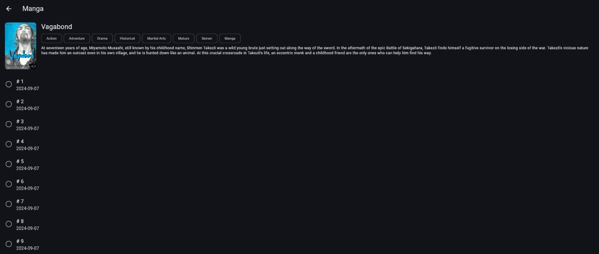

<p align="center">
  
</p>

<h1 align="center">Kai-Shelf</h1>

<p align="center">
  <strong>A cross-platform Flutter manga &amp; comics reader for self-hosted servers</strong>
</p>

<p align="center">
  <a href="https://github.com/abduznik/kai-shelf/releases"></a>
  <a href="https://github.com/abduznik/kai-shelf/blob/main/LICENSE"></a>
  
  <a href="https://github.com/abduznik/kai-shelf/stargazers"></a>
  <a href="https://github.com/abduznik/kai-shelf/issues"></a>
  <a href="https://github.com/sponsors/abduznik"></a>
</p>

<p align="center">
  <a href="#features">Features</a> •
  <a href="#supported-servers">Servers</a> •
  <a href="#installation">Install</a> •
  <a href="#configuration">Config</a> •
  <a href="#contributing">Contributing</a> •
  <a href="#license">License</a>
</p>

---

## Screenshots

<p align="center">
  
</p>
<p align="center">
  
</p>

---

**Kai-Shelf** is a modern, fast manga and comics reader built with [Flutter](https://flutter.dev). Connect it to your self-hosted manga server and read your library on any device — phone, tablet, desktop, or browser.

Currently supports **[Suwayomi-Server](https://github.com/Suwayomi/Suwayomi-Server)** (formerly Tachidesk). More server backends planned.

> **Why Kai-Shelf?** Existing clients are either abandoned (Sorayomi — last update July 2025), limited to one platform, or feel like afterthoughts. Kai-Shelf is built from day one as a polished, cross-platform native experience.

## Features

- 📚 **Library Management** — Browse, search, filter, and organize your manga collection
- 📖 **Beautiful Reader** — Vertical scroll, paged mode, and custom reading directions
- 🔄 **Sync & Updates** — Automatic chapter update checks, reading progress sync
- ⬇️ **Offline Reading** — Download chapters for reading without a connection
- 🔌 **Extension Management** — Install, update, and configure source extensions
- 🌙 **Dark & Light Themes** — Adaptive themes that follow your system settings
- 📱 **Cross-Platform** — One codebase, native feel on Android, iOS, Windows, and Web
- ⚡ **Fast & Lightweight** — Flutter native performance, no Electron overhead
- 🔒 **Private by Design** — Connects directly to your server, no telemetry, no accounts

## Supported Servers

| Server | Status | Notes |
|--------|--------|-------|
| [Suwayomi-Server](https://github.com/Suwayomi/Suwayomi-Server) | ✅ Supported | GraphQL API, extensions, full library |
| [Komga](https://github.com/gotson/komga) | 🔜 Planned | REST API, OPDS support |
| [Kavita](https://github.com/Kareadita/Kavita) | 🔜 Planned | REST API, manga + books |

Don't see your server? [Open an issue](https://github.com/abduznik/kai-shelf/issues) — we prioritize by demand.

## Installation

### Android
Download the latest `.apk` from [Releases](https://github.com/abduznik/kai-shelf/releases) and sideload it.

### iOS
Download the `.ipa` from [Releases](https://github.com/abduznik/kai-shelf/releases) and install via [AltStore](https://altstore.io/) or [SideStore](https://sidestore.io/).

### Windows
Download the latest `.msi` or `.exe` installer from [Releases](https://github.com/abduznik/kai-shelf/releases).

### Web
Access the web build directly from your server or host it anywhere. No installation needed.

### Build from Source
```bash
git clone https://github.com/abduznik/kai-shelf.git
cd kai-shelf
flutter pub get
flutter run                    # auto-detects platform
flutter run -d chrome          # web
flutter build apk              # Android
flutter build windows          # Windows
```

**Requirements:** Flutter 3.x, Dart 3.x

## Configuration

1. Install and run a [Suwayomi-Server](https://github.com/Suwayomi/Suwayomi-Server) instance
2. Open Kai-Shelf and go to **Settings → Servers**
3. Enter your server URL (e.g., `http://192.168.1.100:4567`)
4. Authenticate if prompted
5. Your library syncs automatically

Multiple servers supported — switch between them from the sidebar.

## Roadmap

- [ ] Suwayomi: full feature parity with Sorayomi/Tsumiru
- [ ] Komga server backend
- [ ] Kavita server backend
- [ ] Reading list / bookmarks
- [ ] Custom reading modes (webtoon, right-to-left)
- [ ] Notification support for new chapters
- [ ] macOS and Linux desktop builds
- [ ] OPDS catalog browsing

## Contributing

Contributions welcome! Check the [issues](https://github.com/abduznik/kai-shelf/issues) for good first issues.

```bash
# Fork, then:
git checkout -b feature/my-feature
flutter test
flutter analyze
```

## Acknowledgments

Built on the shoulders of:
- [Suwayomi-Server](https://github.com/Suwayomi/Suwayomi-Server) — the manga server this client talks to
- [Tachidesk-Sorayomi](https://github.com/Suwayomi/Tachidesk-Sorayomi) — the original Flutter client (now unmaintained)
- [Tachidesk-Tsumiru](https://github.com/Suwayomi/Suwayomi-Tsumiru) — enhanced Sorayomi fork
- [Mihon](https://github.com/mihonapp/mihon) — the Android manga reader that started it all

## License

[MIT](LICENSE) — use it, fork it, ship it.

---

<p align="center">
  <a href="https://github.com/sponsors/abduznik"></a>
</p>
